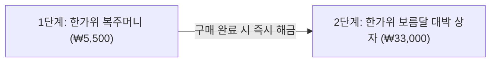

# [기획서] 트렌드 코리아 2026 기반: 운빨존많겜 한가위 대박 버닝 & 유료 스텝업 프로모션

---

## 1. 프로젝트 개요

* **프로젝트명:** 운빨존많겜 2026 한가위 풍년 대축제
* **진행 기간:** 추석 연휴 3일간 (00:00 ~ 23:59)
* **대상:** 전체 유저 (신규 / 복귀 / 기존 활성 유저)
* **핵심 KPI 목표:**
  * 연휴 기간 DAU(일간 활성 유저) 평시 대비 **40% 이상 증대**
  * 이벤트 종료 후 사냥 패스(VIP) 신규 유료 전환율 **15% 이상 달성**
  * 1·2단계 연계 스텝업 IAP를 통한 추석 시즌 ARPPU(유료 결제자당 평균 결제액) 극대화

---

## 2. 기획 배경 및 《트렌드 코리아 2026》 연계 근거

| 이벤트 구성 요소 | 적용 트렌드 키워드 | 세부 연계 근거 및 기획 의도 |
| :--- | :--- | :--- |
| **전원 2배속 무료 & VIP 3일 자동 연장** | **레디코어 (Ready Core)** *(시간 효율성 & 불필요한 대기 최소화)* | • **판당 피로도 제거:** 평균 20~25분에 달하는 한 판 소요 시간을 10분대로 압축하여 명절 자투리 시간에 가볍게 즐길 수 있는 환경 조성 • **VIP 권리 보존:** 기존 VIP 결제자에게 3일 자동 연장을 부여해 시간·비용 손실을 사전에 차단하고 역차별 불만 원천 방지 |
| **3일 압축 출석 보상** *(다이아 3천 / 신화석 100 / 불멸석 50)* | **필코노미 (Feelconomy)** *(감정 케어 & 즉각적 도파민 충족)* | • **체감 효능감 극대화:** 인게임 일회성 소모품인 소환석이나 소량 골드를 과감히 배제 • **확정적 스펙업:** '확률 실패 스트레스'가 큰 게임 구조에서 최상위 핵심 재화(신화석 100개, 불멸석 50개)를 확정 지급하여 명절다운 확실한 기분 전환과 접속 유인 제공 |
| **1·2단계 유료 스텝업 패키지** *(5,500원 ➔ 33,000원)* | **프라이스 디코딩 (Price Decoding)** *(가치 정밀 분석 & 프리미엄 가성비)* | • **1단계 가치 분석 충족:** 5,500원에 다이아 5천+신화석 150개 구성으로 통상 상점 대비 400% 이상 효율을 제공해 결제 장벽 파괴 • **2단계 스펙업 가치 납득:** 불멸석 100개와 한정 테두리를 배치하여 유저가 재화 가치를 계산했을 때 과감히 지갑을 열도록 유도 |

---

## 3. 세부 이벤트 내용

### [Event 1] 전원 2배속 한가위 버닝 & VIP 기간 3일 자동 연장

* **기획 근거 (레디코어):** 모바일 유저의 시성비 니즈를 충족하고 연휴 기간 동안의 판수 회전율을 2배로 증가시킴.
* **진행 방식:**
  * **일반 유저:** 이벤트 3일간 인게임 전투 2배속 가속 모드 전면 무료 적용
  * **사냥 패스(VIP) 보유 유저:** 기존 잔여 구독 일수에 **+3일 자동 연장** 적용 (접속 시 팝업 및 우편 알림)
* **운영 기대 효과:**
  * 일반 유저는 2배속 편의성을 체험하여 이벤트 종료 후 유료 사냥 패스로의 전환(Conversion) 가능성 증대
  * 기존 VIP 유저는 구독 일수가 온전히 보존되어 상대적 박탈감 없이 이벤트 혜택을 누림

---

### [Event 2] 3일 연속 달맞이 출석 이벤트 (무료 우편 지급)

* **기획 근거 (필코노미):** 인게임 플레이 중에만 쓰는 일회성 소환석이나 체감 없는 소량 골드를 배제하고, 성장 체감이 가장 큰 영구 육성 재화로 집중 구성하여 유저 만족도 극대화.
* **지급 방식:** 이벤트 기간 매일 첫 로그인 시 우편함으로 즉시 발송

| 일차 | 지급 재화 | 수량 | 기획 의도 및 기대 체감 |
| :---: | :---: | :---: | :--- |
| **1일차** | **다이아** | **3,000개** | 명절 첫날 영웅 모집 및 상점 이용을 위한 즉각적인 자금 지원 |
| **2일차** | **신화석** | **100개** | 핵심 신화 영웅의 주요 스킬 레벨업(12레벨 등) 확정 달성 지원 |
| **3일차** | **불멸석** | **50개** | 게임 내 엔드 콘텐츠인 불멸 유닛 강화를 위한 초고가치 재화 확정 지급 (3일 완주 유도) |

---

### [Event 3] 추석 한정 1·2단계 유료 스텝업 패키지 (IAP)

* **기획 근거 (프라이스 디코딩):** 1단계를 초고효율 미끼 상품으로 설계해 첫 결제 허들을 부수고, 2단계에서 희소성이 높은 불멸석과 한정판 치장품을 제공하여 연쇄 결제 유도.
* **판매 방식:** 1단계 패키지 구매 완료 시 로비 상점에서 2단계 패키지가 즉시 해금되는 순차 구매 시스템

#### ■ 1단계: 한가위 복주머니 패키지
* **판매 가격:** 5,500원 (계정당 1회 구매 가능)
* **상품 구성:**
  * **다이아 5,000개**
  * **신화석 150개**
  * **에너지 200개** (2배속 버닝 연계 파밍용)
* **프라이스 디코딩 분석:** 상시 판매 상품 대비 4배 이상의 효율로 책정하여 무과금 및 소과금 유저가 가격 대비 압도적 이득임을 즉시 체감하고 구매하도록 유도.

#### ■ 2단계: 한가위 보름달 대박 상자
* **해금 조건:** **1단계 패키지 구매 완료 계정 전용**
* **판매 가격:** 33,000원 (계정당 1회 구매 가능)
* **상품 구성:**
  * **다이아 20,000개**
  * **불멸석 100개**
  * **신화석 300개**
  * **[한정판] 2026 한가위 달토끼 프로필 테두리 & 아이콘 세트**
* **프라이스 디코딩 분석:** 파밍 난이도가 극도로 높은 불멸석 100개와 명절 한정 치장품을 결합하여, 중·고과금 유저가 요구 스펙업 비용을 정밀하게 계산했을 때 대체 불가능한 혜택으로 판단하고 결제하도록 설계.

---

## 4. 기존 통상 지급량 vs 본 기획안 비교 분석

| 비교 항목 | 통상 이벤트 / 점검 쿠폰 평균 | 본 기획안 | 차별점 및 트렌드 반영 효과 |
| :--- | :--- | :--- | :--- |
| **출석 보상 질** | 다이아 1,000~2,000개, 신화석 10~20개 수준 (소환석/골드 혼합) | **다이아 3,000개 / 신화석 100개 / 불멸석 50개** | 체감 없는 잡다한 재화를 전면 배제하고, **필코노미** 기반의 확실한 도파민을 주는 엔드 재화에 집중 |
| **VIP 혜택** | 없음 (단순 패스 할인 판매) | **전원 2배속 + 기존 VIP 3일 자동 연장** | **레디코어** 기반 시성비 제공 및 기존 결제자 박탈감 100% 방어 |
| **BM 구조** | 단일 팝업 패키지 판매 | **1단계(5.5천원) ➔ 2단계(3.3만원) 스텝업 IAP** | **프라이스 디코딩** 심리를 자극하여 구매 장벽 완화 및 단계적 객단가 증대 |

---

## 5. 기대 효과 및 결론

1. **트래픽 및 리텐션 극대화 (Ready Core & Feelconomy):**
   * 2배속 버닝으로 판당 플레이 시간이 절반으로 줄어들어 연휴 이동 중에도 손쉬운 접속이 가능하며, 3일간 이어지는 파격적인 출석 보상(신화석/불멸석)으로 3일 연속 접속률(D3 Retention)을 85% 이상 확보합니다.
2. **사냥 패스 유료 전환율 상승 (Ready Core):**
   * 2배속의 쾌적함을 무료로 경험한 일반 유저들이 이벤트 종료 후 역체감(1배속의 답답함)을 느껴 사냥 패스를 신규 구독하게 되는 전환율을 15% 이상 달성합니다.
3. **매출 시너지 (Price Decoding):**
   * 5,500원이라는 진입 장벽 낮은 1단계를 통해 결제 경험을 만들고, 확실한 스펙업 가치가 증명된 33,000원 2단계 상품으로 연계 결제를 이끌어내 연휴 프로모션 매출 목표치를 초과 달성합니다.